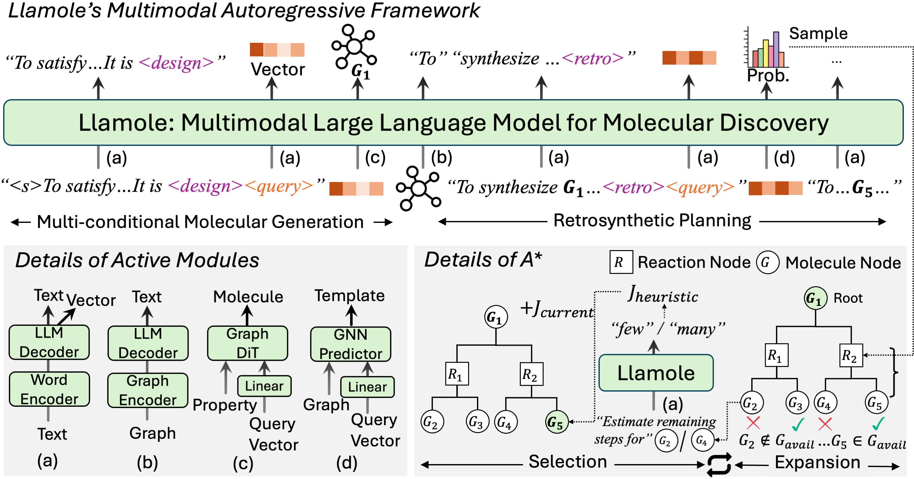
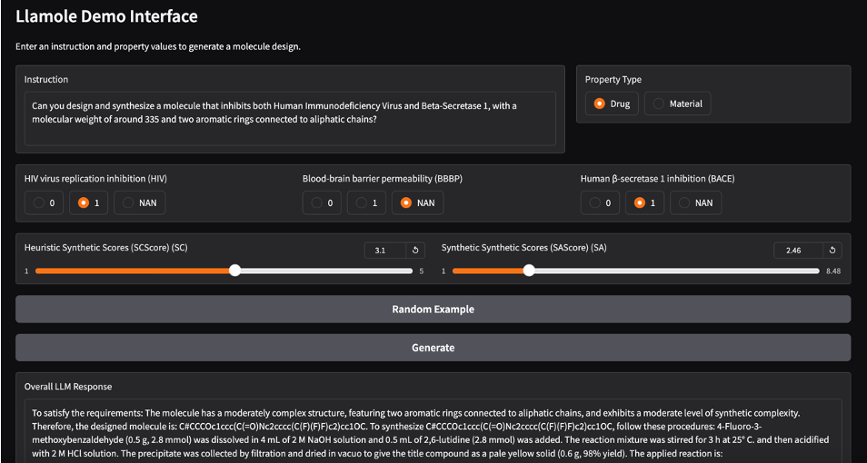

<!-- # 🧬 Llamole: Multimodal Large Language Models for Inverse Molecular Design with Retrosynthetic Planning -->

<div align="center">

# 🔬 🧪 Llamole: Multimodal Large Language Models for Inverse Molecular Design with Retrosynthetic Planning

[](https://arxiv.org/abs/2410.04223)
[](https://github.com/yourusername/Llamole)
[](https://huggingface.co/collections/liuganghuggingface/llamole-collection-67073a2e76b47d5fea909434)

</div>

## 🌟 Introduction

**Llamole** is a multimodal Large Language Model (LLM) that integrates a base LLM with the Graph Diffusion Transformer and Graph Neural Networks for multi-conditional molecular generation and multi-step reaction inference within texts.

📄 **[Paper](https://arxiv.org/abs/2410.04223)**: *Multimodal Large Language Models for Inverse Molecular Design with Retrosynthetic Planning*

<div align="center">

<details>
  <summary>🔍 Abstract</summary>
  <p align="left">
    While large language models (LLMs) have integrated images, adapting them to graphs remains challenging, limiting their applications in materials and drug design. This difficulty stems from the need for coherent autoregressive generation across texts and graphs. To address this, we introduce Llamole, the first multimodal LLM capable of interleaved text and graph generation, enabling molecular inverse design with retrosynthetic planning. Llamole integrates a base LLM with the Graph Diffusion Transformer and Graph Neural Networks for multi-conditional molecular generation and reaction inference within texts, while the LLM, with enhanced molecular understanding, flexibly controls activation among the different graph modules. Additionally, Llamole integrates A* search with LLM-based cost functions for efficient retrosynthetic planning. We create benchmarking datasets and conduct extensive experiments to evaluate Llamole against in-context learning and supervised fine-tuning. Llamole significantly outperforms 14   adapted LLMs across 12 metrics for controllable molecular design and retrosynthetic planning.
  </p>
</details>



</div>

---

## 🛠️ Environment Setup

Initialize the environment by following these steps:

```bash
conda create --name llamole python=3.11 -y
conda activate llamole
./install_environment.sh
```

Alternatively, you can install all required dependencies using the `requirements.sh` script.

---

## 🚀 Model Usage

### 🔧 Requirements

- **Hardware**: A single V100 or A6000 GPU for inference.
- **Configuration Files**:
  - `config/train/{model}_lora.yaml`
  - `config/generate/{model}_{task}.yaml`

### 📥 Automatic Model Download

On the first run, the necessary models will be automatically downloaded, including:

1. **Base LLMs** (Please ensure you have access to the model):
   - [Llama-3.1-8b-Instruct](https://huggingface.co/meta-llama/Llama-3.1-8B)
   - [Qwen2-7B-Instruct](https://huggingface.co/Qwen/Qwen2-7B-Instruct)
   - [Mistral-7B-Instruct-v0.3](https://huggingface.co/mistralai/Mistral-7B-Instruct-v0.3)
   
2. **Pretrained Graph Models**:
   - **Graph Decoder**: [Graph Diffusion Transformer](https://huggingface.co/liuganghuggingface/Llamole-Pretrained-GraphDiT)
   - **Graph Encoder**: [Graph Encoder](https://huggingface.co/liuganghuggingface/Llamole-Pretrained-GraphEncoder)
   - **Graph Predictor**: [GNN Predictor](https://huggingface.co/liuganghuggingface/Llamole-Pretrained-GNNPredictor)

3. **Adapters and Connectors** for integrating the base LLM with pretrained graph models.

### 🗂️ Manual Model Download

If you prefer to download the models manually, place them in the following directories:

- `saves/graph_decoder`
- `saves/graph_encoder`
- `saves/graph_predictor`
- `saves/{model_name}-Adapter`

---

### 🕸️ Gradio-based Web UI

Launch the web interface using Gradio:

```bash
python launch.py
```

The default base LLM is **Qwen2-7B-Instruct**. If you wish to change this, please modify the `args_dict` variable accordingly. Upon launch, the web UI will appear as shown below:

<div align="center">
  
</div>


---

### 💻 Command Line Usage

For command-line evaluation, specify the path to the configuration file:

```bash
python main.py eval config/generate/qwen_material.yaml
```

You can modify the configuration files to suit your custom datasets.

**Note**: Examples of training and evaluation datasets are available in the `data` folder. For more details, refer to `data/dataset_info.json`. To test generation on all MolQA questions, first download the dataset by running:

```bash
python main.py download_data
```

Then, update the configuration files to point to the downloaded dataset based on the names from `data/dataset_info.json`.

---

## 📚 Supervised Fine-Tuning

The codebase supports multimodal graph-text supervised fine-tuning. Follow these steps:

1. **Download MolQA Training Data**:

   ```bash
   python main.py download_data
   ```
   Then you may need to modify the configuration files in the `config` folder to point to the downloaded training data. Skipping this step and directly using the command from step 2 will result in training only on the example training set.

2. **Run Fine-Tuning**:

   ```bash
   python main.py train config/train/mistral_lora.yaml
   ```

   During the first run, pretrained graph models will be downloaded in the `saves` folder. Modify the configuration files as needed for your setup. An 80G A100 GPU is recommended for supervised fine-tuning.

---
## 📖 Citation

If you find this repository useful, please cite our paper:

```
@misc{liu2024llamole,
      title={Multimodal Large Language Models for Inverse Molecular Design with Retrosynthetic Planning}, 
      author={Gang Liu and Michael Sun and Wojciech Matusik and Meng Jiang and Jie Chen},
      year={2024},
      eprint={2410.04223},
      archivePrefix={arXiv},
      primaryClass={cs.LG},
      url={https://arxiv.org/abs/2410.04223}, 
}
```

@article{liu2024graphdit,
  title={Graph Diffusion Transformers for Multi-Conditional Molecular Generation},
  author={Liu, Gang and Xu, Jiaxin and Luo, Tengfei and Jiang, Meng},
  journal={Thirty-Eighth Annual Conference on Neural Information Processing Systems},
  year={2024}
}

---

## 📄 Acknowledgments

This codebase is built upon **[Llama-Factory](https://github.com/hiyouga/LLaMA-Factory)**. We extend our gratitude for their open-source contributions.

---

## 📂 Additional Resources

🔗 **Huggingface Models**: Llamole is developed with three variants (adapters) and three pretrained graph modules (encoder, decoder, predictor):
- **Base LLM Variant 1**: [Llama-3.1-8b-Instruct](https://huggingface.co/liuganghuggingface/Llamole-Llama-3.1-8B-Instruct-Adapter)
- **Base LLM Variant 2**: [Qwen2-7B-Instruct](https://huggingface.co/liuganghuggingface/Llamole-Qwen2-7B-Instruct-Adapter)
- **Base LLM Variant 3**: [Mistral-7B-Instruct-v0.3](https://huggingface.co/liuganghuggingface/Llamole-Mistral-7B-Instruct-v0.3-Adapter)
- **Pretrained Graph Decoder** for multi-conditional molecular generation: [Graph Diffusion Transformer](https://huggingface.co/liuganghuggingface/Llamole-Pretrained-GraphDiT)
- **Pretrained Graph Predictor** for one-step reaction prediction: [GNN Predictor](https://huggingface.co/liuganghuggingface/Llamole-Pretrained-GNNPredictor)
- **Pretrained Graph Encoder** for enhanced molecule understanding: [Graph Encoder](https://huggingface.co/liuganghuggingface/Llamole-Pretrained-GraphEncoder)

---
